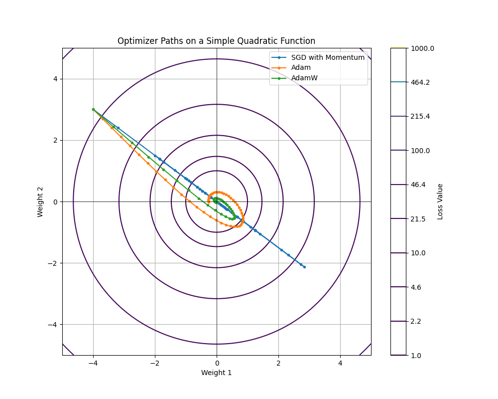
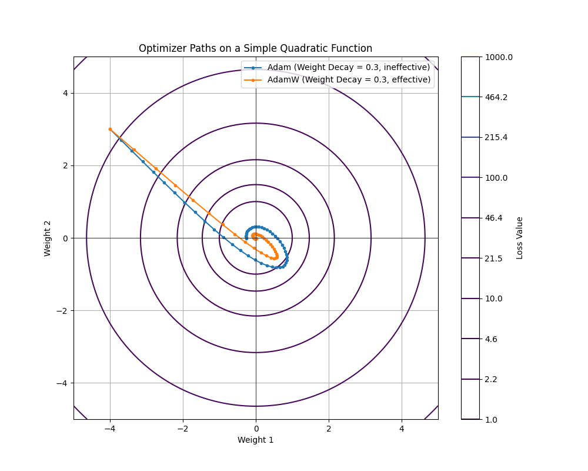

# AdamW Explained: A Visual, Step-by-Step Tutorial

Welcome! This tutorial breaks down the AdamW optimizer, an essential tool for training modern neural networks. We'll go from the foundational concepts of momentum and adaptive learning rates to the specific improvement that makes AdamW so effective: decoupled weight decay.

This guide is paired with a Python script (`visualize_adamw.py`) that generated the plots you see below.

---

## The Goal: Finding the Lowest Point

All optimizers share a common goal: to minimize a **loss function**. Think of the loss function as a landscape with hills and valleys. The optimizer's job is to start at some random point and navigate this landscape to find the lowest possible valley.

For our visualizations, we use a simple, bowl-shaped landscape defined by the function `w1^2 + w2^2`. The lowest point (the "loss minimum") is clearly at `(0, 0)`. The contour lines on the plots show points of equal height (equal loss).

*Fig 1: The paths taken by SGD with Momentum, Adam, and AdamW to find the minimum. All start from the same point.*

---

## Part 1: The Foundations - Momentum and Adaptive Learning

AdamW is built on two powerful ideas that were first combined in the original **Adam** optimizer.

### A. Momentum: Smoothing the Path

Imagine a ball rolling down a hill. It doesn't just follow the steepest path at each instant; it builds up momentum. This helps it to blast through small bumps and stay on a more direct course toward the bottom.

In optimization, **momentum** works the same way. Instead of just using the current gradient to decide on the next step, we maintain a *moving average* of past gradients.

**The Math:**
`m = beta1 * m + (1 - beta1) * g`

- `m` is the momentum (our moving average).
- `g` is the current gradient.
- `beta1` is a hyperparameter (usually ~0.9) that controls how much we rely on past gradients versus the new one.

This moving average acts like the "velocity" of our ball, smoothing the optimization path and accelerating convergence, as you can see in the relatively smooth curve of the SGD with Momentum path in Fig 1.

### B. Adaptive Learning Rates (RMSProp): Adjusting the Step Size

Some parts of our loss landscape might be steep and narrow, while others are flat and wide. A single, fixed step size (learning rate) is not ideal.
- In a steep, narrow canyon, a large step could cause us to bounce from wall to wall.
- On a flat plain, a small step would take forever to cross.

The core idea of **RMSProp** (which Adam incorporates) is to adapt the learning rate for each parameter individually. It does this by tracking a moving average of the *squared* gradients.

**The Math:**
`v = beta2 * v + (1 - beta2) * g^2`

- `v` tracks the variance (the moving average of squared gradients).
- `beta2` is a hyperparameter (usually ~0.999).

When we make an update, we divide the learning rate by the square root of `v`.
- **High variance (`v` is large):** Gradients are inconsistent or large. We take smaller steps to be cautious.
- **Low variance (`v` is small):** Gradients are consistent and small. We can afford to take larger, more confident steps.

---

## Part 2: Adam - Combining Momentum and Adaptive Rates

The **Adam** (Adaptive Moment Estimation) optimizer simply combines these two ideas. At each step, it calculates both the momentum (`m`) and the variance (`v`) and uses them to make a "smart" update.

**The Math (Simplified):**
1. `m = beta1 * m + (1 - beta1) * g`
2. `v = beta2 * v + (1 - beta2) * g^2`
3. `w = w - lr * m / (sqrt(v) + epsilon)`

The `epsilon` is just a tiny number to prevent division by zero. This combination makes Adam incredibly powerful and robust, often converging much faster than SGD, as seen in Fig 1.

---

## Part 3: The Problem with Weight Decay in Adam

**Weight Decay** is a regularization technique. Its goal is to keep the model's weights small to prevent overfitting. It does this by adding a penalty to the loss function that is proportional to the size of the weights. This is equivalent to subtracting a small fraction of the weight at each update step:

`w = w - lr * weight_decay * w`

In the original Adam optimizer, this weight decay term was mixed in with the gradient `g`. This might seem fine, but it creates an issue: the weight decay gets scaled by the adaptive learning rate (`sqrt(v)`).

This means that for parameters with historically large gradients (large `v`), the effective weight decay is *reduced*. For parameters with small gradients, the decay is *stronger*. This coupling is often not what we want. We typically want regularization to be a consistent, predictable force.

## Part 4: AdamW - The Solution

**AdamW** ("W" for Weight Decay) solves this problem with a simple but effective change: it **decouples** the weight decay from the optimization step.

Here's the process:
1.  **Adam Step:** First, perform the standard Adam update based on momentum and variance, but *without* any weight decay mixed into the gradients.
    `w_temp = w - lr * m / (sqrt(v) + epsilon)`
2.  **Decoupled Decay:** After that, apply the weight decay directly to the updated weights.
    `w_final = w_temp - lr * weight_decay * w_temp`

This ensures that the weight decay is applied uniformly to all weights, exactly as intended, regardless of their gradient history.

### Visualizing the Difference

*Fig 2: A comparison of Adam (with ineffective weight decay) and AdamW. Notice how AdamW's path is pulled more strongly and directly toward the origin (0,0) because its weight decay is applied correctly and effectively.*

In this plot, we can see that AdamW's path is more direct. The weight decay acts as a consistent force pulling the weights toward zero, and because it's decoupled from the adaptive learning rate, this force remains strong and effective throughout the optimization process, leading to better regularization and often better final model performance.
