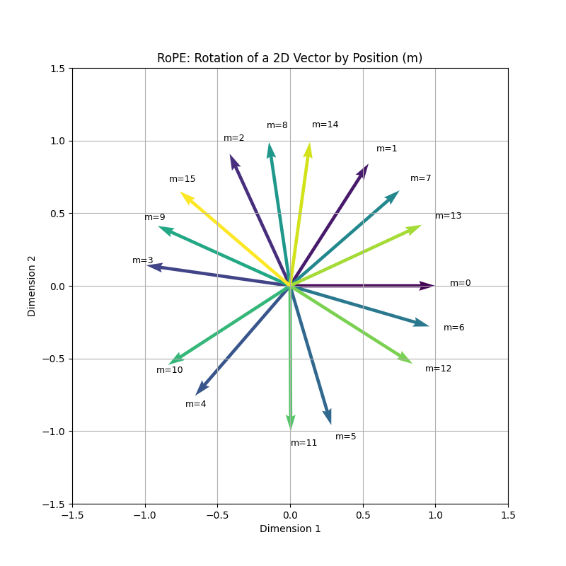
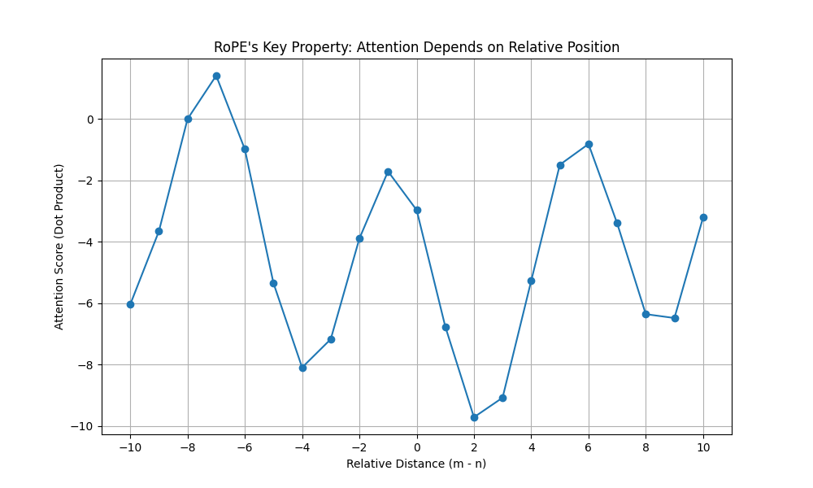

# RoPE Explained: A Visual, Step-by-Step Tutorial

Welcome! This is a guide to understanding Rotary Positional Embeddings (RoPE), one of the most effective methods for giving transformer models a sense of word order. We'll explore how RoPE works not by adding numbers to our vectors, but by *rotating* them in a clever way.

This guide is paired with a Python script (`visualize_rope.py`) that generated the plots you see below.

---

## The Problem: Transformers are "Order-Blind"

By default, the self-attention mechanism in a transformer is "permutation-invariant." This means it treats the sentence "You shall not pass" the same as "Pass you shall not." It sees the words as a "bag" of tokens without any inherent order.

To understand language, the model *must* know the position of each token. Older methods involved creating a separate "positional encoding" vector and adding it to the word embedding. RoPE takes a more elegant approach.

## Part 1: The Core Idea - Encoding Position with Rotation

The central insight of RoPE is to represent a token's absolute position by rotating its vector. The amount of rotation depends on where the token is in the sequence.

Imagine a vector representing the word "hello" at the start of a sentence (position `m=0`). Now, imagine that same word at position `m=1`, `m=2`, and so on. RoPE applies a unique rotation for each position.

*Fig 1: A simple 2D vector is rotated as its position `m` increases. Notice how the angle of rotation is larger for later positions. This is the fundamental mechanic of RoPE.*

How is this rotation calculated?
- The vector is split into pairs of dimensions (e.g., `(v1, v2)`, `(v3, v4)`, ...).
- Each pair is treated like a point on a 2D plane and is rotated by an angle.
- The angle is calculated as `m * θ_i`, where `m` is the token's position and `θ_i` is a fixed "base" frequency that is different for each pair.

This means that different parts of the vector rotate at different speeds, creating a rich and unique positional signal.

**The Math:**
For a pair of features `(x, y)` at position `m`, the rotation is a standard 2D rotation matrix:
- `x' = x * cos(m*θ_i) - y * sin(m*θ_i)`
- `y' = x * sin(m*θ_i) + y * cos(m*θ_i)`

---

## Part 2: The Magic - Relative Positions

This is where RoPE truly shines. While it encodes *absolute* position through rotation, this formulation has a beautiful side effect: the attention score between two tokens becomes dependent only on their **relative position**.

The attention score between a query vector `q` at position `m` and a key vector `k` at position `n` is calculated by their dot product. It can be mathematically shown that the dot product of their RoPE-rotated versions is a function of their *relative distance* (`m - n`).

`dot(q_rotated_m, k_rotated_n) = function(q, k, m - n)`

This is exactly what we want from a positional encoding! In language, the relationship between "the" and "cat" in "the cat sat" (distance = 1) is similar to the relationship in "and then the cat" (distance = 1). The absolute positions don't matter as much as their relative spacing.

Our visualization script confirms this property empirically. We took two random vectors, `q` and `k`, and calculated their dot product at various absolute positions (`m`, `n`) while keeping their relative distance (`m-n`) constant. We then plotted the average score for each relative distance.

*Fig 2: The dot product (attention score) between two vectors after applying RoPE. The score is consistent for a given relative distance, regardless of the absolute positions of the tokens. For example, the score for a distance of -5 is the same whether it's between tokens (10, 15) or (20, 25).*

This plot clearly shows that the attention score is a clean function of the relative distance, allowing the transformer to learn relationships like "the word that came 2 steps before" in a robust and generalizable way.

---

## Summary: Why is RoPE so Effective?

1.  **Encodes Relative Position:** As shown, it naturally captures the distance between tokens, which is crucial for understanding context.
2.  **No Additive Changes:** Unlike older methods, it doesn't "pollute" the word embedding by adding a separate positional vector. It modifies the existing vector through rotation, preserving more of the original information.
3.  **Scales to Long Sequences:** The rotational property means its effectiveness doesn't degrade with longer sentences, a problem some other methods face.

By using the elegant mathematics of rotation, RoPE provides a powerful and stable way to give transformers the sense of order they need to understand language.
